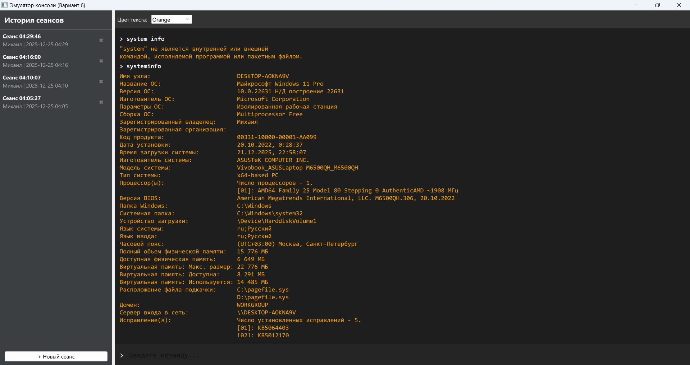
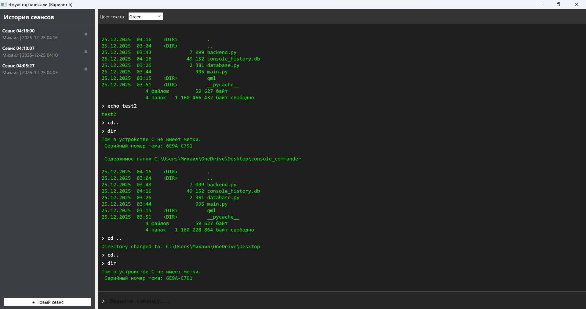
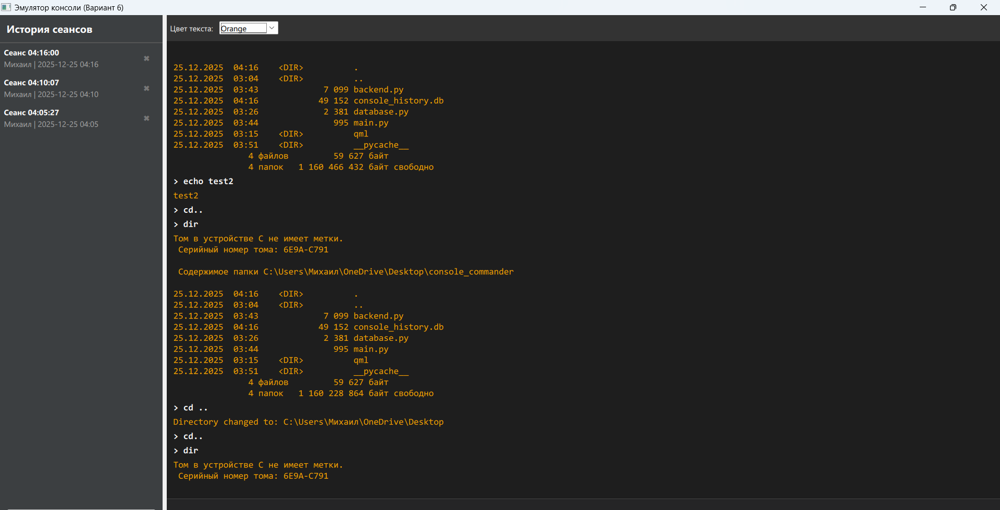
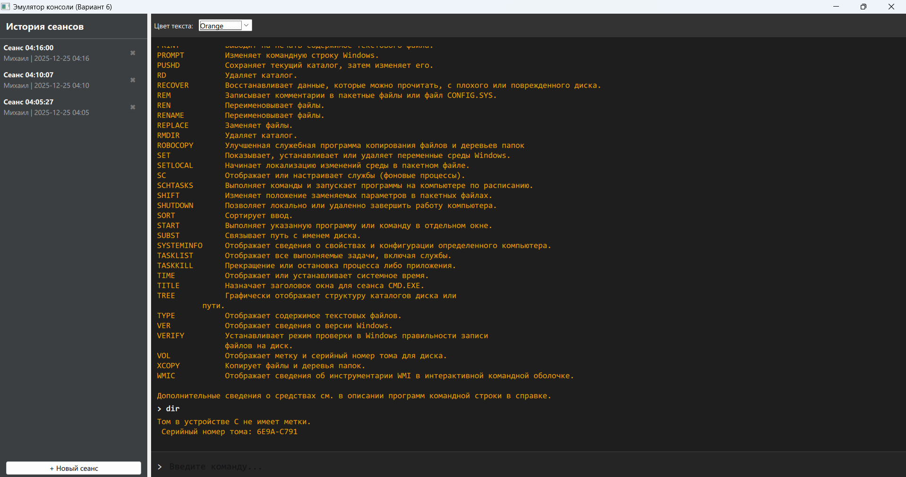
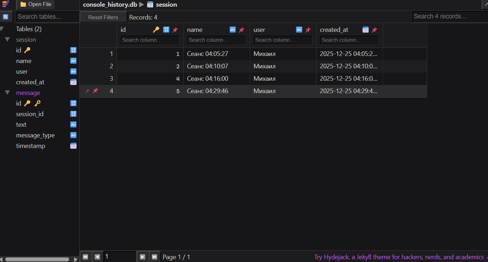
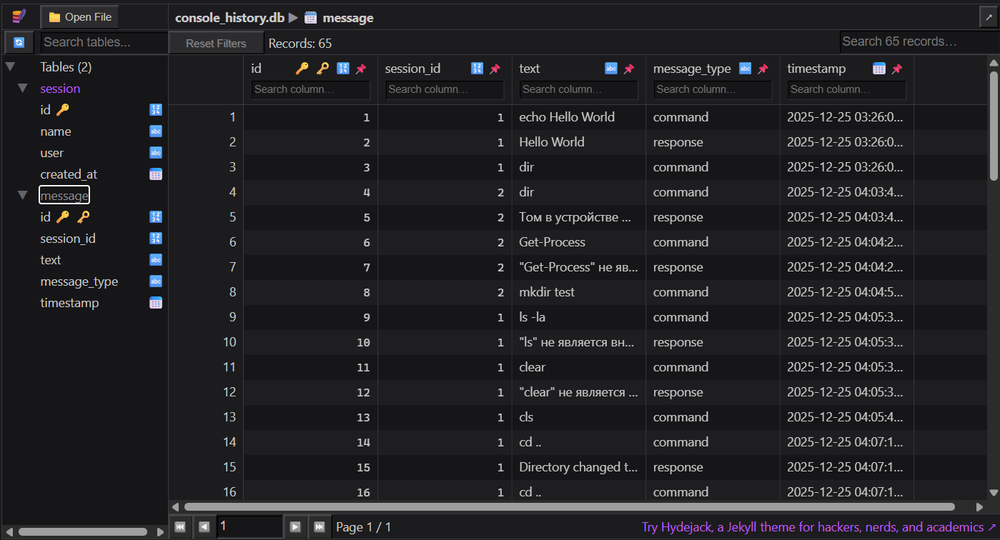

# Эмулятор консоли (Console Emulator)

Курсовой проект по дисциплине «Средства разработки прикладного программного обеспечения».
**Вариант 6:** Эмулятор консоли для работы с командной строкой.

## Описание
Приложение имитирует работу системного терминала (как cmd.exe или bash). Позволяет выполнять системные команды, сохранять историю ввода/вывода в базу данных SQLite и управлять сеансами работы.

**Стек технологий:**
*   **Язык:** Python 3.9+
*   **GUI:** Qt (PySide6) + QML
*   **База данных:** SQLite (через ORM Peewee)

## Функционал
1.  **Выполнение команд:** Поддержка стандартных команд ОС (`dir`/`ls`, `ping`, `ipconfig` и др.).
2.  **История сеансов:** Все команды сохраняются. Можно вернуться к старому сеансу и посмотреть историю.
3.  **Навигация:** Поддержка команды `cd` для смены директории.
4.  **Кастомизация:** Возможность смены цвета текста терминала.
5.  **БД:** Автоматическое создание и инициализация базы данных.

## Демонстрация работы

### Главное окно и выполнение команд


### Работа с историей и настройки




### Демонстрация базы данных



## Установка и запуск

1.  **Клонировать репозиторий:**
    ```bash
    git clone https://github.com/Friezzer/console_emulator.git
    cd console_emulator
    ```

2.  **Установить зависимости:**
    ```bash
    pip install -r requirements.txt
    ```

3.  **Запустить:**
    ```bash
    python main.py
    ```
